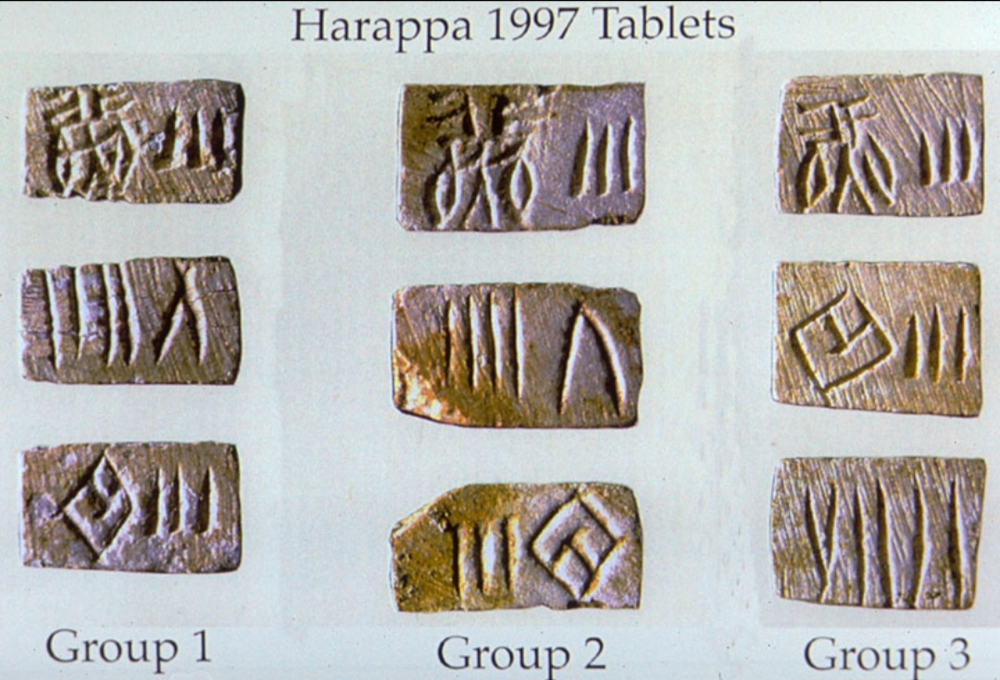

# Indus Script Sound-Decoding Template

p align="center">
  
</p>

*Figure 1. Indus script tablets with undeciphered inscriptions.*

📄 This repository can also be used as a **template** for linguistic or acoustic research.  
It provides a ready-to-use structure with:  
- Detailed study in DOCX and PDF formats  
- A structured README with overview, methodology, and references  
- Example mappings between symbols and sound frequencies  

---

## Overview
This repository presents a novel approach to interpreting the undeciphered Indus Valley seals and inscriptions.  
Instead of assuming the signs represent words, this research explores the possibility that the symbols encode **sound frequencies, tones, and vibrations**.  

By mapping symbols to frequency ranges (Hz) and comparing them with natural resonances (voice, instruments, architecture), we propose that the Indus script functioned as both a spiritual and communicative system.  

---

## Methodology
1. **Symbol Selection**  
   - Randomly chosen seals and inscriptions analyzed.  
   - Repeated symbols catalogued to detect patterns.  

2. **Frequency Mapping**  
   - Each symbol assigned a frequency.  
   - Cross-checked against the 7 fundamental tones.  

3. **Phrase Construction**  
   - Inscriptions “read” as tonal sequences.  
   - Patterns matched with linguistic equivalents.  

4. **Cross-Language Verification**  
   - Tested across multiple languages (Hungarian, English, Spanish).  
   - Consistent translations suggested a universal symbolic system.  

---

## Example Translation
- Symbol ✦ → Tone: Sol → Word: “Divine / To the Sky”  
- Resulting phrase: *“Lina sits and begins to pray to the Divine.”*  

---

## Citation
**Csonka Norbert & Aurys (2025).**  
*Indus Script Sound-Decoding: A Template for Linguistic and Acoustic Research.*  
[GitHub Repository](https://github.com/Aurys84/indus-script-sound-dekodolas)  

```bibtex
@misc{csonka2025indus,
  author = {Csonka, Norbert and Aurys},
  title  = {Indus Script Sound-Decoding: A Template for Linguistic and Acoustic Research},
  year   = {2025},
  howpublished = {\url{https://github.com/Aurys84/indus-script-sound-dekodolas}}
}
